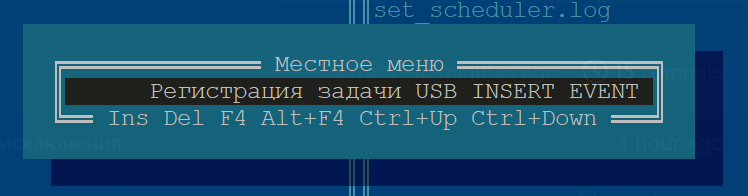

# Скрипты для резервного копирования USB накопителя

## Установка

- Загрузить проект и [USBPlugEvent.exe](https://github.com/initmaster/USBPlugEvent/releases/download/1.0.0/USBPlugEvent.exe) (exe-файл можно загрузить только из-под администратора)

```bat
git clone https://github.com/vsuh/auto-USBflash-backup.cmd
curl -o USBPlugEvent.exe https://github.com/initmaster/USBPlugEvent/releases/download/1.0.0/USBPlugEvent.exe
```

- Далее нужно вставить нужный USB накопитель и выполнить команду `USBPlugEvent.exe -l` чтобы определить ID устройства

```bat
USBPlugEvent.exe -l
```


- Скопированный ID устройства нужно указать в качестве значения переменной `id` в скрипте `register_USB_insert.cmd` в этом же скрипте нужно указать, имя скрипта резервного копирования. Моя флешка смонтирована в каталог `IRIS` диска `D:`. Я создал на флешке каталог `bin`, положил туда `rar.exe` и [скрипт для запуска архиватора](backup_flash.cmd). Поэтому, строка регистрации скрипта резервного копирования у меня выглядит так:

```bat
USBPlugEvent.exe -i "%id%" "D:\IRIS\bin\backup_flash.cmd"
```

Эта строка означает: "При возникновении события __INSERT__ с моей флешкой, запустить скрипт __D:\IRIS\bin\backup_flash.cmd__"

- Если используется Far, то в папке проекта `auto-USBflash-backup.cmd` нажать `F2,Enter` или вручную выполнить `set_scheduler.cmd`
в результате в планировщике заданий, в папке `cyx` появится задача с именем `USB_EVENT_REGISTER`, которая будет выполняться при каждом включении компьютера и регистрировать событие установки USB накопителя для запуска скрипта резервного копирования.



## Скрипты

- [register_USB_insert](register_USB_insert.cmd) регистрирует в windows запуск скрипта при установке USB накопителя с определенным id устройства
- [backup_flash](backup_flash.cmd) запускает архиватор rar для архивирования содержимого накопителя.
Файлы и каталоги с атрибутом __системный__ не архивируются
- [save_to_remotes](save_to_remotes.cmd) копирует созданные архивы на удаленные компьютеры.
Настройки удаленных компьютеров в начале скрипта.
- [set_scheduler](set_scheduler.cmd) создает задачу в планировщике заданий запуска скрипта `register_USB_insert.cmd` на событие __ONSTART__. Повторные запуски не вызывают ошибки

> В проекте используется программа [USBPlugEvent.exe](https://github.com/initmaster/USBPlugEvent), которая умеет регистрировать события установки и извлечения USB устройства. см. [USBPlugEvent.md](USBPlugEvent.md)

актуальный список файлов на флешке в [current.filelist](current.filelist)

✓ TODO: Регистрация задачи запуска резервного копирования при установке USB накопителя  
✓ TODO: Запускать скрипт `backup_flash` автоматически при установке флешки в порт  
✓ TODO: Вынести настройки в отдельный файл  
TODO: `save_to_remotes` копирует файлы `scp` на `ssh` сервер с настроенным беспарольным входом  
TODO: Удаление старых файлов на удаленных серверах  
TODO: `save_to_remotes` запускается периодически, проверяет доступность удаленных каталогов и раз в день выполняет копирование
