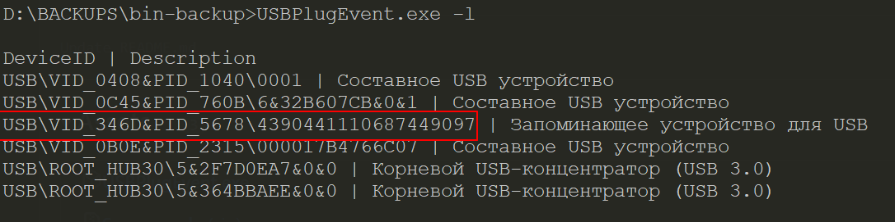

# Скрипты для резервного копирования USB накопителя

## Установка

- Загрузить проект и [USBPlugEvent.exe](https://github.com/initmaster/USBPlugEvent/releases/download/1.0.0/USBPlugEvent.exe) (exe-файл можно загрузить только из-под администратора)

```bat
git clone https://github.com/vsuh/auto-USBflash-backup.cmd
curl -o USBPlugEvent.exe https://github.com/initmaster/USBPlugEvent/releases/download/1.0.0/USBPlugEvent.exe
```
- Создать свой экземпляр настроек - `settings.ini`

```
copy settings.ini.dist settings.ini
```

- Далее нужно вставить нужный USB накопитель и выполнить команду `USBPlugEvent.exe -l` чтобы определить ID устройства

```bat
USBPlugEvent.exe -l
```



- Скопированный ID устройства нужно указать в качестве значения переменной `vsuh.USBflash.id` в файле настроек `settings.ini`,
в этом же файле можно изменить имя скрипта резервного копирования (`BACKUP.cmd`). 
Все пути расчитываются относительно пути из переменной `vsuh.flash.mountpoint`\bin.
Моя флешка смонтирована в каталог `IRIS` диска `D:`. Я создал на флешке каталог `bin`, положил туда `rar.exe` 
и [скрипт для запуска архиватора](BACKUP.cmd). Поэтому, мои настройки выглядят так:

```bat
vsuh.USBflash.id       = USB\VID_346D&PID_5678\4390441110687449097
vsuh.flash.mountpoint  = D:\IRIS
vsuh.task.name         = \cyx\USB_EVENT_REGISTER
...
vsuh.backup.files.path = S:\backups\USB
...
vsuh.val.1              = !USERNAME!
vsuh.val.2              = !USERDOMAIN!\!USERNAME!
vsuh.val.3              = D:\IRIS\bin\BACKUP.cmd
vsuh.val.4              = D:\IRIS\bin\cmd\register_USB_insert.cmd\ admin
vsuh.val.5              = D:\IRIS\bin

```

- Выполнить `INSTALL.cmd`. (В Far-е это можно сделать через пользовательское меню - F2)
В результате в планировщике заданий появится задача с именем __%vsuh.task.name%__, которая будет выполняться при каждом включении компьютера и регистрировать событие установки USB накопителя для запуска скрипта резервного копирования  __%vsuh.cmdpath.backup%__.

## Скрипты

- [register_USB_insert](cmd/register_USB_insert.cmd) регистрирует в windows запуск скрипта при установке USB накопителя с определенным id устройства
- [BACKUP](BACKUP.cmd) запускает архиватор rar для архивирования содержимого накопителя.
Файлы и каталоги с атрибутом __системный__ не архивируются
- [save_to_remotes](cmd\save_to_remotes.cmd) копирует созданные архивы на удаленные компьютеры.
- [INSTALL](INSTALL.cmd) создает задачу в планировщике заданий запуска скрипта `register_USB_insert.cmd` на событие __ONSTART__. 

> В проекте используется программа [USBPlugEvent.exe](https://github.com/initmaster/USBPlugEvent), которая умеет регистрировать события установки и извлечения USB устройства. см. [USBPlugEvent.md](USBPlugEvent.md)

актуальный список файлов на флешке в [current.filelist](current.filelist)

✓ TODO: Регистрация задачи запуска резервного копирования при установке USB накопителя  
✓ TODO: Запускать скрипт `backup_flash` автоматически при установке флешки в порт  
✓ TODO: Вынести настройки в отдельный файл  
✓ TODO: Создавать задачи из xml файлов, заполненных по шаблону
TODO: `save_to_remotes` копирует файлы `scp` на `ssh` сервер с настроенным беспарольным входом  
TODO: Удаление старых файлов на удаленных серверах  
TODO: `save_to_remotes` запускается периодически, проверяет доступность удаленных каталогов и раз в день выполняет копирование  
